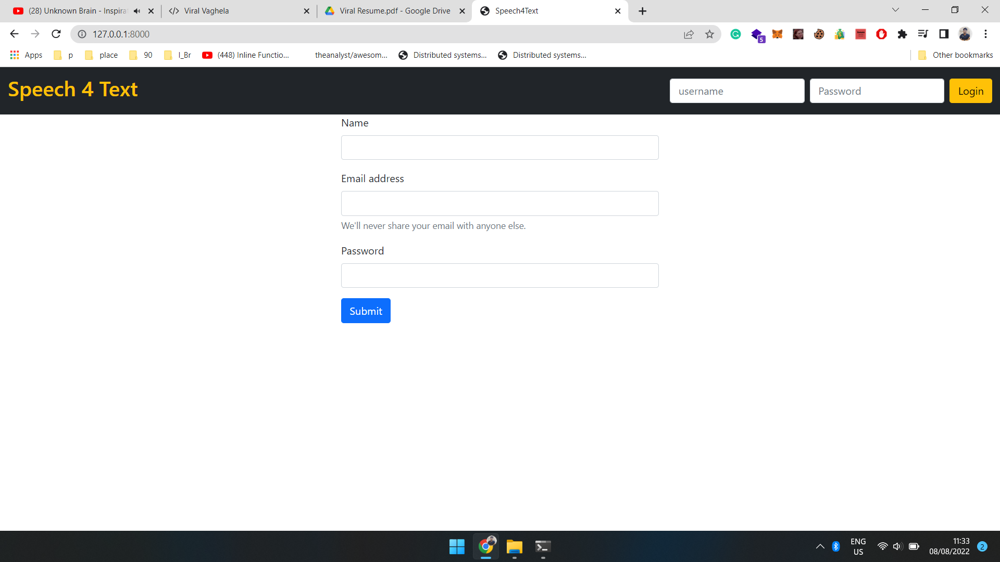
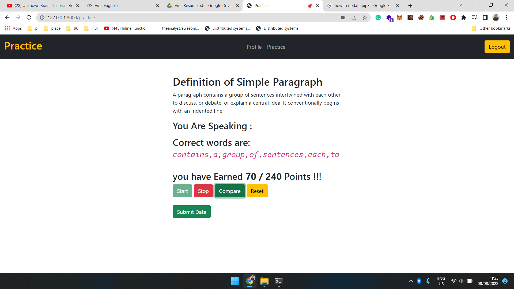
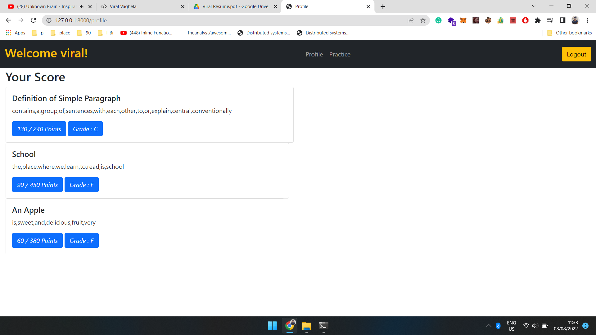
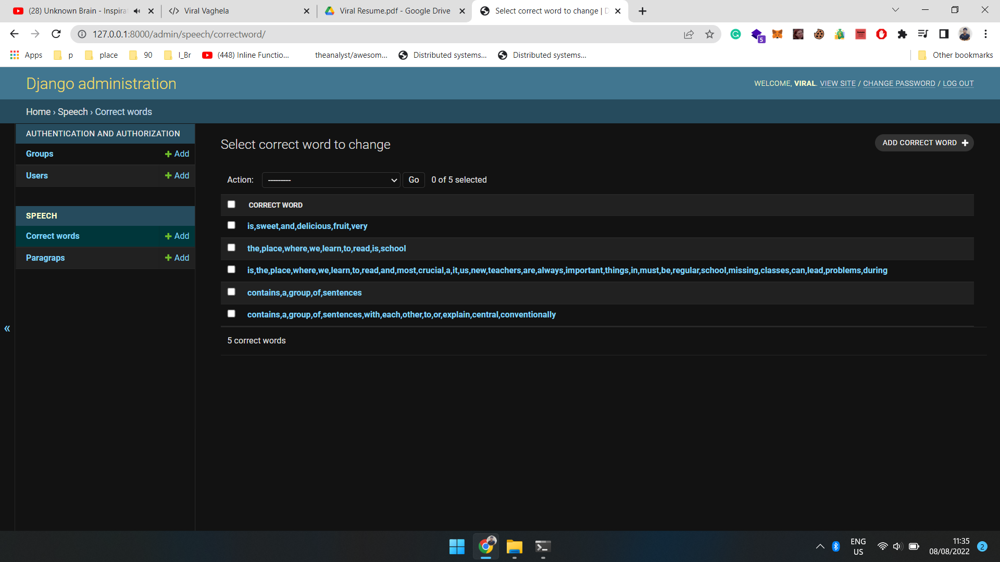
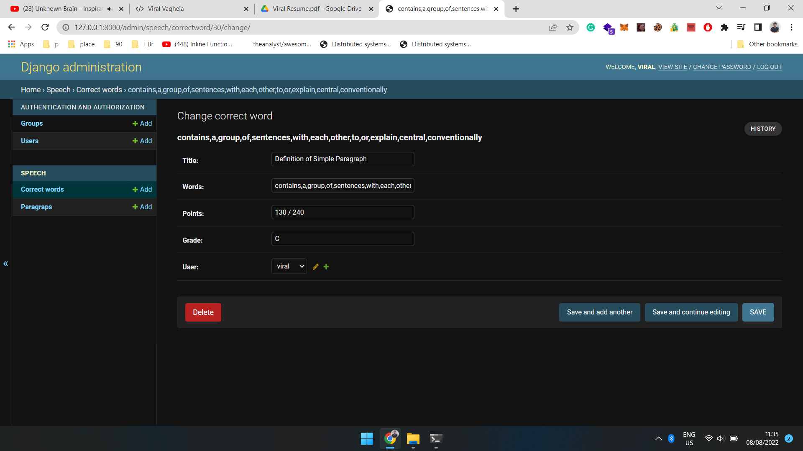
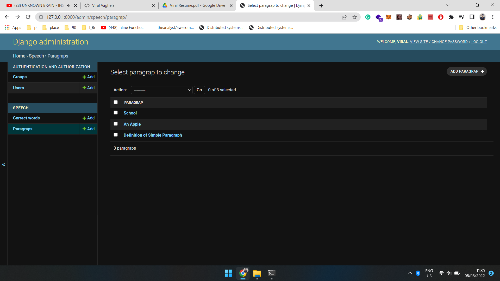

# Speech 4 Text

It is a platform for deaf people to learn new words and helps them to speak words better using socoring system.

### Technologies used:
**Backend:**    
- Django
- SQLite3

**Frontend:**
- Bootstrap And Html-CSS
- JS for speach recognition

**Screenshots:**

User Registration and Login



Practice page where user can practice their words



Profile page where user can see their profile and old words which they have learned



Admin panel : where admin can see correct words data  





Admin panel : where admin can add new random paragraphs to database



### How to setup:
```bash 
git clone https://github.com/viralvaghela/speach-4-text
cd speach-4-text
python manage.py runserver
```

Hit the Star ⭐ on the top right corner if you like this project :)